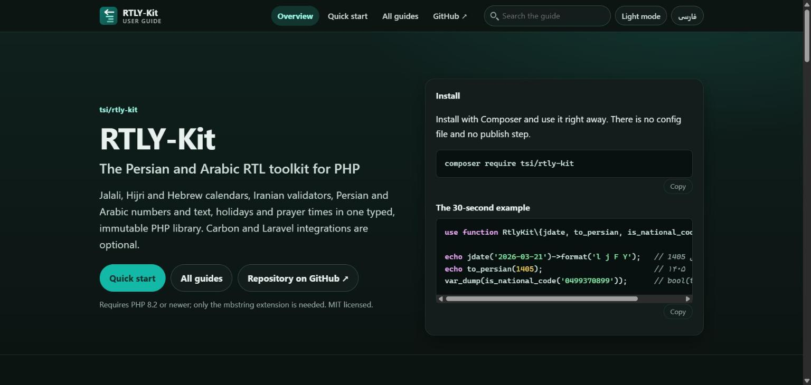
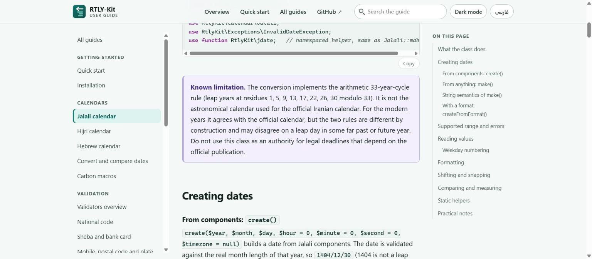
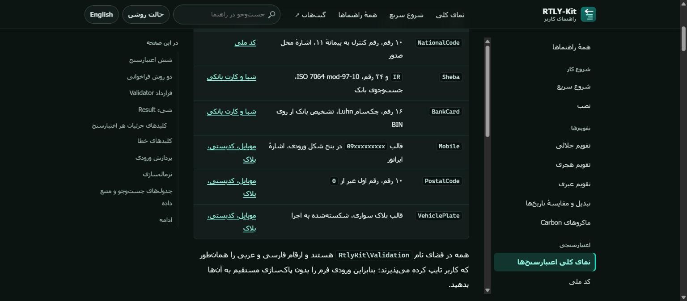

<div align="center">

**English** | [فارسی](.github/README.fa.md) | [العربية (guide)](https://ehsanenaloo.github.io/RTLY-Kit/ar/)

<a href="https://ehsanenaloo.github.io/RTLY-Kit/"></a>

# RTLY-Kit

**Dates, numbers and checks for Persian and Arabic PHP apps.**

Jalali, Hijri and Hebrew calendars. Iranian validators. Number words, holidays and prayer times.
One small package. No required dependencies.

[](https://packagist.org/packages/enaxon/rtly-kit)
[](https://ehsanenaloo.github.io/RTLY-Kit/)
[](https://buymeacoffee.com/enaloo)

[](https://github.com/ehsanenaloo/RTLY-Kit/actions/workflows/ci.yml)
[](https://packagist.org/packages/enaxon/rtly-kit)
[](https://packagist.org/packages/enaxon/rtly-kit)
[](https://www.php.net/)
[](https://ehsanenaloo.github.io/RTLY-Kit/en/laravel-setup.html)
[](#requirements)
[](https://ehsanenaloo.github.io/RTLY-Kit/)
[](LICENSE)
[](https://github.com/ehsanenaloo/RTLY-Kit/stargazers)

<a href="https://ehsanenaloo.github.io/RTLY-Kit/en/"></a>

</div>

## Why this exists

Persian and Arabic PHP tools are spread over many packages. One handles Jalali dates. Another checks national codes. A third turns numbers into words. Most of them need Carbon or a whole framework.

RTLY-Kit puts the common pieces in one place. It is plain PHP. You install it, import a function and use it. There is no setup step, and the config file is optional.

---

## Install

```bash
composer require enaxon/rtly-kit
```

```php
require 'vendor/autoload.php';

use function RtlyKit\{jdate, to_persian, number_to_words, is_national_code};

echo jdate('2026-03-21')->format('l j F Y');   // شنبه 1 فروردین 1405
echo to_persian(1405);                         // ۱۴۰۵
echo number_to_words(1234);                    // یک هزار و دویست و سی و چهار
var_dump(is_national_code('0499370899'));      // bool(true)
```

The helpers are namespaced functions, so they cannot clash with your own code. If you like short global names, you can [turn them on](#helpers-without-clashes).

---

## What is inside

| Area | What you get |
|---|---|
| **Calendars** | Jalali, Hijri (Umm al-Qura) and Hebrew. Immutable, comparable with each other, plain PHP |
| **Validators** | National code, Sheba, bank card, mobile, postal code, vehicle plate. Clear results with stable error codes |
| **Numbers** | Persian, Arabic and English digits. Separators, ordinals. Number words in Persian and Arabic, with gender, case and vowel marks for Arabic |
| **Text** | Arabic to Persian letters, ZWNJ cleanup, direction and script detection, Persian slugs |
| **Holidays** | Official Iranian holiday dates for 1394 and 1396 to 1405, reported dates for 1380 to 1393 and 1395, estimates for other years. Offsets and overrides, weekends and business days |
| **Prayer times** | Tehran, MWL, ISNA, Egypt, Makkah and Karachi methods, high-latitude rules and manual tuning |
| **Carbon and Laravel** | Carbon macros, six validation rules, a `Jalali` facade, an Eloquent cast and an optional config file |

---

## What you can do

### Work with three calendars

`Jalali`, `Hijri` and `Hebrew` share one contract, so you can compare dates from different calendars.

```php
use RtlyKit\Calendar\Jalali;
use function RtlyKit\{jdate, hdate, hebrew_date};

$date = jdate('2026-03-21');
echo $date->addMonths(1)->format('Y/m/d');                       // 1405/02/01
echo Jalali::create(1405, 1, 1)->toGregorian()->format('Y-m-d'); // 2026-03-21

echo hdate('2026-03-21')->format('j F Y', 'en');            // 2 Shawwal 1447
echo hebrew_date('2026-03-21')->format('j F Y', 'en');      // 3 Nisan 5786
```

All three are plain PHP. You do not need `ext-calendar`. See the [Jalali guide](https://ehsanenaloo.github.io/RTLY-Kit/en/jalali.html) and the [compare guide](https://ehsanenaloo.github.io/RTLY-Kit/en/convert-and-compare.html).

### Check Iranian data

Each validator gives you a clear result, not just true or false.

```php
use function RtlyKit\{validate_sheba, validate_national_code};

$result = validate_sheba('IR27 0170 0000 0010 0324 2000 01');
$result->isValid();   // true
$result->details();   // ['normalized' => 'IR270170000000100324200001', 'bank_code' => '017', 'bank_name' => 'بانک ملی ایران']

$bad = validate_national_code('0499370898');
$bad->errors();       // ['invalid_checksum']
```

Error codes are stable strings, like `invalid_format` and `invalid_checksum`. You turn them into your own messages. Validators never throw. Odd input, such as `null` or an array, gives `invalid_type`. A mobile result also tells you if the prefix lies in a mobile block of the national numbering plan (`allocated`).

### Write numbers and clean text

```php
use RtlyKit\Number\NumberToWords;
use function RtlyKit\{format_number, ordinal, normalize_text, text_direction, number_to_words};

echo format_number(1234567.5);          // ۱٬۲۳۴٬۵۶۷٫۵
echo ordinal(30);                       // سی‌ام
echo normalize_text('كتاب ٣ يك');        // کتاب ۳ یک
echo text_direction('سلام');            // rtl
echo number_to_words(1234, 'ar');       // ألف ومئتان وأربعة وثلاثون

// Arabic: a counted noun follows, and it is feminine
echo NumberToWords::convert(3, 'ar', ['mode' => 'noun', 'gender' => 'f']);   // ثلاث
echo NumberToWords::ordinal(21, 'ar', ['gender' => 'f']);                     // الحادية والعشرون
```

### Find holidays and prayer times

```php
use RtlyKit\Holiday\HolidayCalendar;
use RtlyKit\Prayer\PrayerTimes;
use function RtlyKit\is_iran_holiday;

var_dump(is_iran_holiday(1405, 1, 1));   // true

// Correct an estimated year when the moon is seen a day later
$calendar = HolidayCalendar::default()->withIslamicOffset(1);
$calendar->sourceOf(1406)->value;        // estimated

$times = PrayerTimes::forCity('mecca', PrayerTimes::METHOD_MAKKAH)
    ->getTimes(new DateTimeImmutable('2026-06-01'));
echo $times['fajr'];                     // 04:11
```

See [Holiday calendar](https://ehsanenaloo.github.io/RTLY-Kit/en/holiday-calendar.html) and [Prayer times](https://ehsanenaloo.github.io/RTLY-Kit/en/prayer-times.html).

### Use it with Carbon and Laravel

Carbon macros turn on by themselves when Carbon is installed.

```php
use Carbon\Carbon;

echo Carbon::parse('2026-03-21')->toJalali()->format('Y/m/d');   // 1405/01/01
echo Carbon::createFromJalali(1405, 1, 1)->toDateString();       // 2026-03-21
echo Carbon::parse('2026-03-21')->toHijri()->format('Y/m/d');    // 1447/10/02
```

Laravel finds the package on its own. You get six validation rules (`mobile` is a short alias of `iran_mobile`) with Persian, English and Arabic messages, a `Jalali` facade and an Eloquent cast. Publish the optional config file with `php artisan vendor:publish --tag=rtly-kit-config`.

```php
$request->validate([
    'national_code' => ['required', 'national_code'],
    'sheba'         => ['required', 'sheba'],
    'phone'         => ['required', 'iran_mobile'],
]);

protected $casts = ['published_at' => \RtlyKit\Laravel\Casts\JalaliCast::class];
```

More in the [Laravel guide](https://ehsanenaloo.github.io/RTLY-Kit/en/laravel-setup.html).

---

## A full guide, in three languages

The guide has 29 pages in English, Persian and Arabic. It has search, a light and a dark theme, and works without JavaScript. Persian and Arabic pages are written right to left.

<table>
  <tr>
    <td width="50%"><a href="https://ehsanenaloo.github.io/RTLY-Kit/en/jalali.html"></a></td>
    <td width="50%"><a href="https://ehsanenaloo.github.io/RTLY-Kit/fa/validators-overview.html"></a></td>
  </tr>
  <tr>
    <td align="center"><sub>English, light theme</sub></td>
    <td align="center"><sub>Persian, dark theme, right to left</sub></td>
  </tr>
</table>

| Topic | Read |
|---|---|
| Start | [Quick start](https://ehsanenaloo.github.io/RTLY-Kit/en/quick-start.html) · [Installation](https://ehsanenaloo.github.io/RTLY-Kit/en/installation.html) |
| Calendars | [Jalali](https://ehsanenaloo.github.io/RTLY-Kit/en/jalali.html) · [Hijri](https://ehsanenaloo.github.io/RTLY-Kit/en/hijri.html) · [Hebrew](https://ehsanenaloo.github.io/RTLY-Kit/en/hebrew.html) · [Convert and compare](https://ehsanenaloo.github.io/RTLY-Kit/en/convert-and-compare.html) · [Carbon macros](https://ehsanenaloo.github.io/RTLY-Kit/en/carbon-macros.html) |
| Validation | [Validators overview](https://ehsanenaloo.github.io/RTLY-Kit/en/validators-overview.html) · [National code](https://ehsanenaloo.github.io/RTLY-Kit/en/national-code.html) · [Sheba and bank card](https://ehsanenaloo.github.io/RTLY-Kit/en/sheba-and-bank-card.html) · [Mobile, postal code, plate](https://ehsanenaloo.github.io/RTLY-Kit/en/mobile-postal-plate.html) |
| Numbers and text | [Digits and format](https://ehsanenaloo.github.io/RTLY-Kit/en/digits-and-format.html) · [Number words](https://ehsanenaloo.github.io/RTLY-Kit/en/number-words.html) · [Arabic number words](https://ehsanenaloo.github.io/RTLY-Kit/en/arabic-number-words.html) · [Text tools](https://ehsanenaloo.github.io/RTLY-Kit/en/text-tools.html) |
| Dates and times | [Holidays](https://ehsanenaloo.github.io/RTLY-Kit/en/holidays.html) · [Holiday calendar](https://ehsanenaloo.github.io/RTLY-Kit/en/holiday-calendar.html) · [Prayer times](https://ehsanenaloo.github.io/RTLY-Kit/en/prayer-times.html) |
| Laravel | [Setup](https://ehsanenaloo.github.io/RTLY-Kit/en/laravel-setup.html) · [Validation and cast](https://ehsanenaloo.github.io/RTLY-Kit/en/laravel-validation-and-cast.html) |
| Reference | [Helpers](https://ehsanenaloo.github.io/RTLY-Kit/en/helpers-and-globals.html) · [Errors](https://ehsanenaloo.github.io/RTLY-Kit/en/error-handling.html) · [API stability](https://ehsanenaloo.github.io/RTLY-Kit/en/api-stability.html) · [Accuracy and data](https://ehsanenaloo.github.io/RTLY-Kit/en/accuracy-and-data.html) · [Limits](https://ehsanenaloo.github.io/RTLY-Kit/en/limits.html) · [Upgrade](https://ehsanenaloo.github.io/RTLY-Kit/en/upgrade.html) · [Verifying releases](https://ehsanenaloo.github.io/RTLY-Kit/en/verifying-releases.html) · [FAQ](https://ehsanenaloo.github.io/RTLY-Kit/en/troubleshooting-faq.html) |
| Other languages | [فارسی](https://ehsanenaloo.github.io/RTLY-Kit/fa/) · [العربية](https://ehsanenaloo.github.io/RTLY-Kit/ar/) |

---

## Helpers without clashes

The 27 helpers live in the `RtlyKit` namespace. Import what you need with `use function`. Nothing is added to the global scope.

Want short names like `jdate()`? Switch them on once, for example in your bootstrap file:

```php
$skipped = \RtlyKit\Globals::register();   // names that were already taken
```

It only adds names that are free. It never replaces your functions and never throws. You can call it twice. The return value lists any names it skipped.

---

## When something goes wrong

Every error the library throws extends `RtlyKit\Exceptions\RtlyKitException`. Catch that one class and you have them all. Each error has a stable code and some context:

```php
use RtlyKit\Exceptions\RtlyKitException;
use function RtlyKit\jdate;

try {
    jdate('not a date');
} catch (RtlyKitException $e) {
    $e->getErrorCode();   // an ErrorCode case, here invalid_date
    $e->getContext();     // extra details, as an array
}
```

Bad input never leaks a raw `TypeError` or `ValueError`. Years outside the supported range throw `InvalidDateException`. Read the [error guide](https://ehsanenaloo.github.io/RTLY-Kit/en/error-handling.html) for the full list.

---

## What we checked

On 2026-10-08 we compared the library with official sources wherever we could reach them.

- **Jalali.** The conversion gives the same Nowruz dates and leap years as the official table of the University of Tehran for every year from 1206 to 1497. It agrees with the astronomical definition for 1178 to 1502.
- **Hijri.** Every month start from AH 1318 to 1500 (2196 months) matches the official KACST Umm Al-Qura calendar. AH 1300 to 1317 use ICU/CLDR data.
- **Holidays.** Official dates for the Jalali years 1394 and 1396 to 1405, checked against two sources, and published dates for 1380 to 1393 and 1395. Other years are estimated from the Hijri calendar. Fixed holidays, like Nowruz, are exact.
- **Prayer times.** Sunrise and sunset match the NOAA Solar Calculator within a minute. Compared with published tables, the times agree within 1 to 2 minutes for Tehran (Fajr, sunrise, noon, Maghrib), Makkah (all times, including Isha in Ramadan), Egypt (Dar al-Ifta) and Karachi with Hanafi Asr (a Karachi institution, 31 days). The Fajr and Isha of Turkey's Diyanet fit the 18 and 17 degree angles. The Hanafi Asr rule and the ISNA 15 degree angles match statements of Darul Uloom Deoband and the Fiqh Council of North America.
- **Data tables.** The 19 Sheba bank codes in the Central Bank's published IBAN specification match our table. Every mobile prefix we list lies inside a mobile block of the national numbering plan. Bank BINs and other codes agree with several public pages.

### Good to know

- Iran sets religious dates by moon sighting, so an estimated year can be a day or two off. You can correct it with [HolidayCalendar](https://ehsanenaloo.github.io/RTLY-Kit/en/holiday-calendar.html).
- We found no timetable issued by ISNA, the Muslim World League or the University of Islamic Sciences in Karachi, and no official Tehran table with Isha and Asr.
- Bank, operator and place names come from public lists, not from an official registry. A valid card can return `null` for the bank name.
- A few Arabic number-word outputs still wait for review by a native speaker.

Found a mistake? Please [open an issue](https://github.com/ehsanenaloo/RTLY-Kit/issues/new/choose) with a source. The full list is in the [accuracy guide](https://ehsanenaloo.github.io/RTLY-Kit/en/accuracy-and-data.html).

---

## Requirements

- PHP **8.2** or newer. That is all it needs. No `mbstring` or other extension is required.
- No required Composer packages. `nesbot/carbon` and `illuminate/support` are optional.
- Tested in CI on PHP 8.2, 8.3, 8.4 and 8.5. Works with Laravel 11, 12 and 13 (Laravel 13 needs PHP 8.3 or newer) and Carbon 3.

---

## Contributing

Bug reports, data corrections, translation fixes and small pull requests are welcome. Read [CONTRIBUTING.md](.github/CONTRIBUTING.md) first. It explains the Docker workflow, the code style and how we handle data sources.

- **Report a wrong result.** Use the data-correction form and add a source. Every table entry needs at least two.
- **Improve the words.** Fixes for the Persian guide and for Arabic translations are very welcome.
- **Star the repository** if it saves you time. It helps other people find it.

If RTLY-Kit saves you time, you can [buy me a coffee](https://buymeacoffee.com/enaloo). It is never expected, and it is very much appreciated.

Security problems go through [SECURITY.md](.github/SECURITY.md), not public issues.

### Contributors

Thanks to everyone who has helped. Your name appears here after your first merged contribution.

<a href="https://github.com/ehsanenaloo/RTLY-Kit/graphs/contributors"></a>

Moving from an early build? See [UPGRADE.md](UPGRADE.md). Recent changes are in [CHANGELOG.md](CHANGELOG.md).

---

## License

[MIT](LICENSE). Data sources and their notes are in [SOURCES.md](resources/data/SOURCES.md) and [NOTICE](NOTICE).

## About

Made by [Ehsan Enaloo](https://github.com/ehsanenaloo). RTLY-Kit is a toolkit for Jalali, Hijri and Hebrew calendars, Iranian validators, number words, holidays and prayer times in PHP.

Topics: `jalali` `hijri` `hebrew` `persian` `arabic` `rtl` `php` `laravel` `carbon` `iran` `prayer-times`
